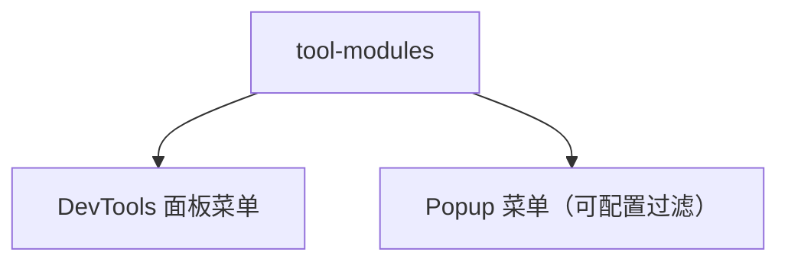

# 变更提案: popup-modules-config

## 元信息
```yaml
类型: 优化
方案类型: implementation
优先级: P2
状态: 已完成
创建: 2026-01-27
```

---

## 1. 需求

### 背景
当前 Popup 弹窗内的工具菜单与 DevTools 面板（tools.html）左侧菜单存在不一致，且两处菜单配置分散，后续新增工具容易再次产生偏差。

### 目标
- 提供一个配置参数，用于控制哪些工具模块展示到 Popup
- 默认情况下 Popup 菜单与面板一致（同一套工具模块注册表）

### 约束条件
```yaml
时间约束: 无
性能约束: 不引入明显运行时开销
兼容性约束: 保持现有路由与入口不变（HashRouter）
业务约束: 未配置时保持“跟面板一致”的默认行为
```

### 验收标准
- [ ] 未配置 `popupVisibleToolIds` 时，Popup 菜单展示的模块与面板菜单一致
- [ ] 配置 `popupVisibleToolIds` 白名单后，Popup 仅展示指定模块且顺序按配置
- [ ] `npm run compile` 与 `npm run build` 通过

---

## 2. 方案

### 技术方案
- 新增 `utils/tool-modules.ts` 作为工具模块注册表（面板菜单与 Popup 菜单共用）
- 新增 `utils/ui-config.ts` 暴露配置参数 `popupVisibleToolIds`
  - `undefined`: 未配置，Popup 展示全部（与面板一致）
  - `ToolId[]`: 白名单过滤 Popup 展示模块（顺序按数组定义）
- Popup 侧通过 `resolveToolModulesByIds()` 基于白名单生成展示列表；未知 id 自动忽略

### 影响范围
```yaml
涉及模块:
  - entrypoints/popup: Popup 菜单渲染与过滤逻辑
  - entrypoints/tools.html: 面板菜单来源改为注册表
  - utils: 工具模块注册表与 UI 配置
预计变更文件: 4~6
```

### 风险评估
| 风险 | 等级 | 应对 |
|------|------|------|
| Popup 默认展示项变多，可能影响菜单紧凑度 | 低 | 可通过 `popupVisibleToolIds` 白名单裁剪 |
| 白名单配置包含未知 id | 低 | 过滤时忽略未知 id，不影响渲染 |

---

## 3. 技术设计（可选）

> 本变更不涉及架构/API/数据模型调整，略。

### 架构设计


### API设计
N/A

### 数据模型
N/A

---

## 4. 核心场景

> 执行完成后同步到对应模块文档

### 场景: Popup 菜单展示与跳转
**模块**: Popup
**条件**: 用户打开扩展 Popup
**行为**: Popup 根据 `popupVisibleToolIds` 生成菜单并展示；点击某项打开 `tools.html#/{toolId}`
**结果**: 成功打开对应工具页面；未配置时菜单与面板一致

---

## 5. 技术决策

> 本方案涉及的技术决策，归档后成为决策的唯一完整记录

### popup-modules-config#D001: 工具菜单使用单一注册表并对 Popup 提供白名单配置
**日期**: 2026-01-27
**状态**: ✅采纳
**背景**: Popup 与面板的菜单配置分散，导致展示不一致且维护成本增加
**选项分析**:
| 选项 | 优点 | 缺点 |
|------|------|------|
| A: 各入口各自维护菜单 | 改动小 | 易再次不一致 |
| B: 统一工具注册表 + Popup 白名单过滤 | 单一事实来源；Popup 可配置裁剪 | 初次需要做一次抽取 |
**决策**: 选择方案 B
**理由**: 彻底消除“菜单不一致”的根因，并满足“Popup 可配置展示模块”的需求
**影响**: `entrypoints/tools.html/App.tsx`、`entrypoints/popup/App.tsx`、`utils/*`
