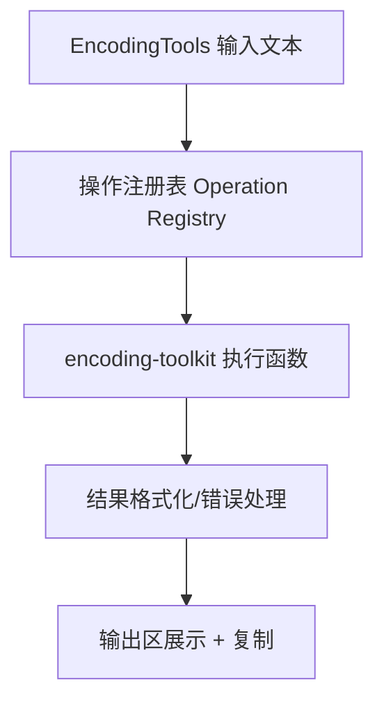

# 变更提案: encoding-encrypt-decrypt-tools

## 元信息
```yaml
类型: 新功能
方案类型: implementation
优先级: P1
状态: 已实施
创建: 2026-02-07
```

---

## 1. 需求

### 背景
当前 `编码转换` 工具仅覆盖 Base64 与 URL 编解码，无法满足开发场景中对哈希、HTML 实体、Unicode/UTF16 转义、Gzip 压缩解压、JWT 快速解码、Cookie 结构化查看等高频需求。用户已明确给出需要补充的加密/解密能力清单。

### 目标
1. 在现有 `components/EncodingTools.tsx` 中补充以下能力：
   - 加密/编码：Unicode(`\\u`)、URL(`%`)、UTF16(`\\x`)、Base64、MD5、十六进制、SHA1、HTML普通编码、HTML深度编码、HTML转JS、Gzip压缩
   - 解密/解码：Unicode(`\\u`)、URL(`%`)、UTF16(`\\x`)、Base64、十六进制、HTML实体、URL参数解析、JWT解码、Cookie格式化、Gzip解压
2. 保持现有输入/输出/复制/交换/清空交互不退化。
3. 对结构化结果（URL参数、JWT、Cookie）输出可读文本（JSON pretty）。

### 约束条件
```yaml
时间约束: 本次 ~plan 仅完成方案设计，不进入代码实施
性能约束: 常规文本处理应保持即时响应，大体积 Gzip 文本需提供明确报错/提示
兼容性约束: 保持 Chrome/Firefox 扩展环境可用（WXT 项目）
业务约束: 全部处理在本地执行，不引入外部服务调用
```

### 验收标准
- [ ] 编码转换页可见并可执行用户列出的全部加密/解密操作。
- [ ] 各操作在有效输入下输出正确结果，非法输入给出可读错误信息。
- [ ] 操作映射表完整覆盖全部 21 项能力（加密 11 + 解密 10），无遗漏无重复。
- [ ] UI 按“加密/解密”分组展示，分组标签与操作归属正确。
- [ ] Gzip 压缩输出 Base64 字符串，解压接受 Base64 输入还原原文；超过阈值（建议 1 MB）时给出明确提示。
- [ ] 空输入、超长文本、非法编码串等边界场景有一致的错误处理行为。
- [ ] URL参数解析、JWT解码、Cookie格式化输出结构化文本（可复制）。
- [ ] 原有 Base64/URL 交互（编码、解码、交换、复制、清空）保持可用。
- [ ] 新增或更新单元测试覆盖核心工具函数（正常/边界/异常）。

---

## 2. 方案

### 技术方案
1. **工具函数层扩展**
   - 新增统一的编码能力模块（建议新增 `utils/encoding-toolkit.ts`，必要时拆分子模块），集中实现各类 encode/decode/hash/parse/compress 方法。
   - 哈希与压缩能力采用稳定第三方库（建议：`crypto-js` + `pako`）以兼容 MD5 与 Gzip 处理。
2. **UI 层重构为“操作注册表”**
   - 在 `components/EncodingTools.tsx` 维护操作配置（id、标签、分类、执行函数、是否异步、错误文案），减少按钮硬编码。
   - 保留现有 ToolLayout 风格，并将工具按“加密/解密”分组展示。
3. **结果格式化策略统一**
   - 纯文本结果直接输出。
   - 结构化结果统一 `JSON.stringify(value, null, 2)` 输出，保障可读性与可复制性。
4. **输入输出约定前置固化**
   - UTF16(`\\x`)按“字节十六进制转义”处理，不按 UCS-2 四位编码解释。
   - Gzip 约定为“压缩输出 Base64、解压输入 Base64”，并在 UI hint 中显式标注。

### 影响范围
```yaml
涉及模块:
  - components/EncodingTools.tsx: 工具列表与执行逻辑重构
  - utils/encoding-toolkit.ts(新): 新增各类编码/解码/压缩/解析函数
  - tests/encoding-tools.test.js(新): 新能力回归测试
  - package.json: 新增依赖（若采用 crypto-js/pako）
  - helloagents/modules/*.md: 新增/更新编码模块知识库文档
  - helloagents/CHANGELOG.md: 记录本次功能扩展
预计变更文件: 6-9
```

### 风险评估
| 风险 | 等级 | 应对 |
|------|------|------|
| UTF16(`\\x`)语义与用户预期不一致 | 中 | 在文档与按钮文案中明确“按字节十六进制转义”规则，并增加示例测试 |
| 大文本 Gzip 压缩/解压可能卡顿 | 中 | 采用同步实现但限制输入规模并提供异常提示；后续可演进为 Worker |
| 引入第三方库导致包体积增加 | 低 | 仅引入必要库并在构建后评估体积影响 |
| Cookie 解析兼容性（多格式、特殊字符、空值） | 中 | 兼容 `key=value; key2=value2` 及 URL 编码值，增加多样化样例测试 |
| Gzip I/O 约定不明确导致互操作困难 | 中 | 明确约定：压缩输出 Base64、解压输入 Base64，并在按钮 hint 中标注 |
| JWT 与独立 JWT 工具能力边界重叠 | 低 | 在编码工具中提供“轻量解码（header/payload）”，高级验证仍保留在 JWT 页面 |

---

## 3. 技术设计（可选）

### 架构设计


### API设计
#### INTERNAL Operation.run(input)
- **请求**: `string` 输入文本
- **响应**: `Promise<string>`（统一为字符串结果，结构化数据先格式化）

### 数据模型
| 字段 | 类型 | 说明 |
|------|------|------|
| id | string | 操作唯一标识 |
| label | string | UI 按钮名称 |
| group | 'encrypt' \| 'decrypt' | 操作分类 |
| run | (input) => Promise<string> | 执行函数 |
| hint | string | 输入格式提示（如 `\\u` / `%` / JWT） |

---

## 4. 核心场景

> 执行完成后同步到对应模块文档

### 场景: 文本快速编码与哈希
**模块**: EncodingTools + encoding-toolkit
**条件**: 用户输入普通文本
**行为**: 点击 Unicode/URL/Base64/MD5/SHA1 等任一编码类操作
**结果**: 输出对应编码或摘要值，并可复制

### 场景: 转义文本反向解码
**模块**: EncodingTools + encoding-toolkit
**条件**: 输入 `\\u` / `%` / `\\x` / Base64 / Hex 等编码串
**行为**: 点击对应解码操作
**结果**: 输出还原文本；非法输入时显示错误提示

### 场景: 结构化内容解析
**模块**: EncodingTools + encoding-toolkit
**条件**: 输入 URL/JWT/Cookie 文本
**行为**: 点击 URL参数解析/JWT解码/Cookie格式化
**结果**: 输出格式化 JSON 文本，便于阅读与复制

### 场景: Gzip 压缩与解压
**模块**: EncodingTools + encoding-toolkit
**条件**: 输入文本或 Base64 压缩串
**行为**: 点击 Gzip压缩/解压
**结果**: 压缩返回 Base64 字符串；解压还原原文

---

## 5. 技术决策

> 本方案涉及的技术决策，归档后成为决策的唯一完整记录

### encoding-encrypt-decrypt-tools#D001: 采用“操作注册表 + 统一执行器”组织编码能力
**日期**: 2026-02-07
**状态**: ✅采纳
**背景**: 操作项从 4 个扩展到 20+，继续使用硬编码按钮与分散处理函数会快速失控。
**选项分析**:
| 选项 | 优点 | 缺点 |
|------|------|------|
| A: 维持现有硬编码按钮 | 改动直观，短期简单 | 重复代码多，后续扩展成本高 |
| B: 操作注册表驱动（选中） | 可扩展性好，错误处理一致，测试粒度清晰 | 初期重构量略大 |
**决策**: 选择方案 B
**理由**: 与新增大量工具的需求最匹配，且可显著降低后续维护成本。
**影响**: `components/EncodingTools.tsx`、新工具函数模块、相关测试。

### encoding-encrypt-decrypt-tools#D002: 哈希与 Gzip 采用成熟库优先
**日期**: 2026-02-07
**状态**: ✅采纳
**背景**: MD5 与 Gzip 需要稳定跨浏览器实现，原生 API 覆盖不完整（尤其 MD5）。
**选项分析**:
| 选项 | 优点 | 缺点 |
|------|------|------|
| A: 原生 API + 自实现补齐 | 依赖少 | 自实现算法风险高，兼容成本高 |
| B: 引入 `crypto-js` + `pako`（选中） | 实现成熟，行为稳定，落地快 | 增加少量依赖体积 |
**决策**: 选择方案 B
**理由**: 更符合工具类项目对正确性与交付效率的要求。
**影响**: `package.json`、工具函数实现与测试基线。
