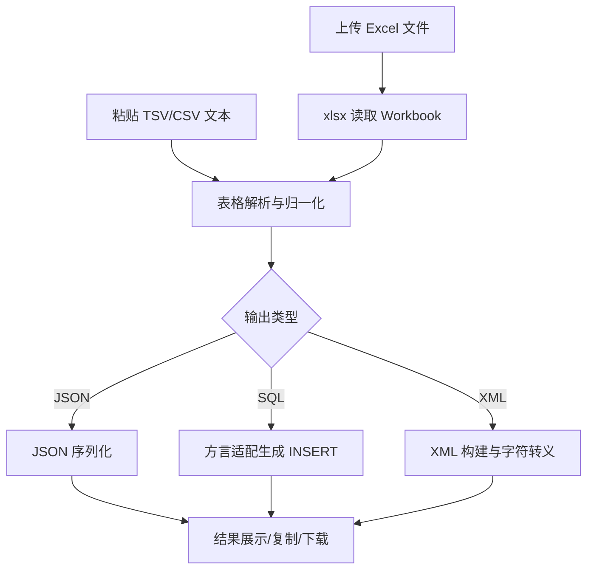

# 变更提案: excel-converter-json-sql-xml

## 元信息
```yaml
类型: 新功能
方案类型: implementation
优先级: P1
状态: 已实施
创建: 2026-02-07
```

---

## 1. 需求

### 背景
当前 Web Helper 已覆盖 JSON、编码转换、JWT、API 调试等工具，但缺少“表格数据结构化转换”能力。用户经常从 Excel / WPS / Google Sheets 复制整块表格数据，希望在浏览器侧**直接粘贴后即转换**，并同时保留文件导入能力，输出 JSON / INSERT SQL / XML，减少手工编写脚本的成本。

### 目标
1. 新增独立工具页面，**默认输入方式为粘贴表格文本（TSV/CSV）**。
2. 提供 Excel 文件上传（`.xlsx/.xls`）作为可选入口，不作为主流程。
3. 支持三种输出格式：JSON / INSERT SQL / XML。
4. SQL 输出支持数据库方言切换：MySQL、Oracle、PostgreSQL。
5. 保持现有工具页面一致交互：预览、复制、下载、错误提示。

### 约束条件
```yaml
时间约束: 本次 ~plan 仅完成方案设计，不进入代码实施
性能约束: 常规数据量（如 <= 2万单元格）应可在前端可接受时间内完成转换
兼容性约束: 保持 WXT + React + TypeScript 工程约定，兼容 Chrome/Firefox 扩展环境
业务约束: 全部转换本地执行，不上传外部服务
```

### 验收标准
- [ ] 工具页默认提供“粘贴数据”文本区，支持直接粘贴表格文本并自动识别分隔符（优先 Tab，其次逗号）。
- [ ] 工具页提供“导入 Excel 文件”可选入口，支持 `.xlsx/.xls`。
- [ ] JSON 输出为稳定可读结构（支持缩进格式化）。
- [ ] SQL 输出支持 `mysql / oracle / pg` 三种方言，正确处理字符串转义、NULL、标识符引用。
- [ ] XML 输出正确转义特殊字符（`& < > \" '`），结构可被常见 XML 解析器读取。
- [ ] 表头为空/重复时，采用稳定列名回退策略（如 `column_1` + 去重后缀）。
- [ ] 工具支持复制与下载输出结果；输入非法时给出可读错误信息。
- [ ] 新增单元测试覆盖转换核心逻辑（正常 + 边界 + 异常）。

---

## 2. 方案

### 技术方案
1. **新增转换核心模块（utils）**
   - 新建 `utils/excel-converter.ts`，提供统一数据归一化与导出能力。
   - 输入双通道：
     - `parseTableText(...)`：解析粘贴的 TSV/CSV 文本（默认主入口）。
     - `parseExcelWorkbook(...)`：解析 Excel 二进制（可选入口）。
   - 输出三函数：
     - `toJsonText(...)`
     - `toInsertSqlText(...)`
     - `toXmlText(...)`

2. **统一中间模型**
   - 无论文本粘贴或文件上传，均先归一化为：`{ columns: string[], rows: Record<string, unknown>[] }`。
   - 将列名修正（空/重复）与值类型规范化集中在归一化阶段，避免三种导出器重复处理。

3. **SQL 方言适配层**
   - 通过 `dialect adapter` 处理方言差异：
     - MySQL：`` `identifier` ``
     - PostgreSQL：`"identifier"`
     - Oracle：`"IDENTIFIER"`（默认大写，可在后续迭代增加配置）
   - 统一字面量规则：字符串单引号转义（`'` -> `''`），空值输出 `NULL`。

4. **新增工具页面组件（components）**
   - 新建 `components/ExcelConverter.tsx`，按现有 `ToolLayout` 风格实现：
     - 输入区（默认：粘贴数据）
     - 可选导入区（上传 `.xlsx/.xls`）
     - 解析信息区（行数、列数、来源类型）
     - 输出类型切换（JSON / SQL / XML）
     - SQL 配置（方言、表名）
     - 输出区（只读文本 + 复制 + 下载）

5. **工具接入**
   - 在 `utils/tool-modules.ts` 注册新工具。
   - 在 `entrypoints/tools.html/App.tsx` 增加路由与组件挂载。
   - Popup 由于使用共享注册表，在 `popupVisibleToolIds` 未限制时自动出现该工具。

### 影响范围
```yaml
涉及模块:
  - utils/excel-converter.ts(新): 粘贴文本/Excel 解析 + JSON/SQL/XML 导出
  - components/ExcelConverter.tsx(新): 工具页面交互与结果展示
  - utils/tool-modules.ts: 新增工具注册项与 ToolId 类型
  - entrypoints/tools.html/App.tsx: 新增工具路由
  - package.json / package-lock.json: 新增 xlsx 依赖
  - tests/excel-converter.test.js(新): 核心转换逻辑测试
  - helloagents/modules/*.md: 开发实施阶段同步模块文档
  - helloagents/CHANGELOG.md: 开发实施阶段记录版本变更
预计变更文件: 7-9
```

### 风险评估
| 风险 | 等级 | 应对 |
|------|------|------|
| 粘贴文本分隔符识别错误（Tab/逗号混用） | 中 | 默认 Tab 优先，失败后尝试 CSV，并提供手动分隔符切换 |
| `.xls` 与 `.xlsx` 类型推断差异 | 中 | 基于 `xlsx` 统一读取并在归一化阶段显式处理空值/日期值 |
| SQL 字符串/标识符转义不当导致语法错误 | 中 | 方言适配集中实现并单测覆盖引号、NULL、特殊字符 |
| 大数据量解析导致 UI 卡顿 | 中 | 首期加入数据量提示与异常文案，后续可演进 Worker |
| 表头缺失/重复导致导出列不稳定 | 中 | 归一化阶段统一列名修正策略，保证可重复输出 |
| XML 转义遗漏导致结构非法 | 低 | 单独封装 `escapeXmlText` 并测试特殊字符样例 |

---

## 3. 技术设计（可选）

### 架构设计


### API设计
#### INTERNAL parseTableText(input)
- **请求**: `string`
- **响应**: `{ columns: string[]; rows: Record<string, unknown>[]; delimiter: '\\t' | ',' }`

#### INTERNAL parseExcelWorkbook(arrayBuffer, sheetName?)
- **请求**: `ArrayBuffer, string?`
- **响应**: `{ sheetNames: string[]; columns: string[]; rows: Record<string, unknown>[] }`

#### INTERNAL toInsertSqlText(rows, options)
- **请求**: `rows + { dialect: 'mysql' | 'oracle' | 'pg', tableName: string }`
- **响应**: `string`（多行 INSERT SQL）

#### INTERNAL toXmlText(rows, options)
- **请求**: `rows + { rootName?: string, rowName?: string }`
- **响应**: `string`（XML 文本）

### 数据模型
| 字段 | 类型 | 说明 |
|------|------|------|
| sourceType | `'paste' \| 'file'` | 当前输入来源 |
| dialect | `'mysql' \| 'oracle' \| 'pg'` | SQL 方言 |
| tableName | `string` | INSERT 目标表名 |
| columns | `string[]` | 归一化后列名 |
| rows | `Record<string, unknown>[]` | 归一化行对象 |
| outputType | `'json' \| 'sql' \| 'xml'` | 输出类型 |

---

## 4. 核心场景

> 执行完成后同步到对应模块文档

### 场景: 粘贴表格文本转 JSON
**模块**: ExcelConverter + excel-converter utils
**条件**: 用户从 Excel/Sheets 复制表格并粘贴到输入区
**行为**: 系统解析并选择 JSON 输出
**结果**: 输出格式化 JSON，可复制/下载

### 场景: 粘贴或导入数据转 INSERT SQL（方言切换）
**模块**: ExcelConverter + SQL dialect adapter
**条件**: 用户已提供数据，填写表名并选择方言
**行为**: 选择 SQL 输出并执行转换
**结果**: 生成对应方言 INSERT 语句

### 场景: 导入 Excel 文件转 XML（可选入口）
**模块**: ExcelConverter + XML serializer
**条件**: 用户点击“导入 Excel 文件”，选择工作表
**行为**: 选择 XML 输出并执行转换
**结果**: 生成合法 XML 文本并完成字符转义

---

## 5. 技术决策

> 本方案涉及的技术决策，归档后成为决策的唯一完整记录

### excel-converter-json-sql-xml#D001: 使用 `xlsx` 统一处理 Excel 文件解析
**日期**: 2026-02-07
**状态**: ✅采纳
**背景**: 需要稳定支持 `.xlsx/.xls`，手写解析成本高且风险大。
**选项分析**:
| 选项 | 优点 | 缺点 |
|------|------|------|
| A: 手写解析 | 无新增依赖 | 成本高、边界复杂、可靠性差 |
| B: 使用 `xlsx`（选中） | 社区成熟、格式支持完整、交付快 | 增加依赖体积 |
**决策**: 选择方案 B
**理由**: 降低格式兼容风险并缩短开发周期。
**影响**: `package.json`、`utils/excel-converter.ts`、相关测试。

### excel-converter-json-sql-xml#D002: 采用“中间模型 + 多导出器”结构
**日期**: 2026-02-07
**状态**: ✅采纳
**背景**: 同一数据源需导出 JSON/SQL/XML，直接在 UI 分支处理会导致逻辑重复。
**选项分析**:
| 选项 | 优点 | 缺点 |
|------|------|------|
| A: 每种格式各自解析 | 实现直观 | 重复清洗逻辑，维护成本高 |
| B: 先归一化再导出（选中） | 可复用、可测试、扩展性好 | 初期抽象稍多 |
**决策**: 选择方案 B
**理由**: 更适合工具型项目长期演进。
**影响**: `utils/excel-converter.ts` 的结构与测试组织方式。

### excel-converter-json-sql-xml#D003: 默认“粘贴优先”，上传作为可选入口
**日期**: 2026-02-07
**状态**: ✅采纳
**背景**: 用户明确要求默认应直接粘贴 Excel 数据而非先上传文件。
**选项分析**:
| 选项 | 优点 | 缺点 |
|------|------|------|
| A: 上传优先 | 结构化来源清晰 | 与用户高频使用路径不一致，操作成本高 |
| B: 粘贴优先（选中） | 操作更快、贴合用户习惯 | 需处理分隔符识别与文本脏数据 |
**决策**: 选择方案 B
**理由**: 更符合用户真实使用场景，交互效率更高。
**影响**: `components/ExcelConverter.tsx` 输入区布局、文本解析逻辑、测试用例覆盖。

### excel-converter-json-sql-xml#D004: SQL 方言差异通过适配器最小实现
**日期**: 2026-02-07
**状态**: ✅采纳
**背景**: 用户要求支持 mysql/oracle/pg，但无需覆盖全部高级特性。
**选项分析**:
| 选项 | 优点 | 缺点 |
|------|------|------|
| A: 单一 SQL 模板 | 实现快 | 方言兼容不足 |
| B: 轻量方言适配器（选中） | 满足主流语法差异，便于扩展 | 需维护少量规则 |
**决策**: 选择方案 B
**理由**: 在复杂度可控前提下满足用户目标。
**影响**: SQL 生成函数、方言测试样例与 UI 选项。
