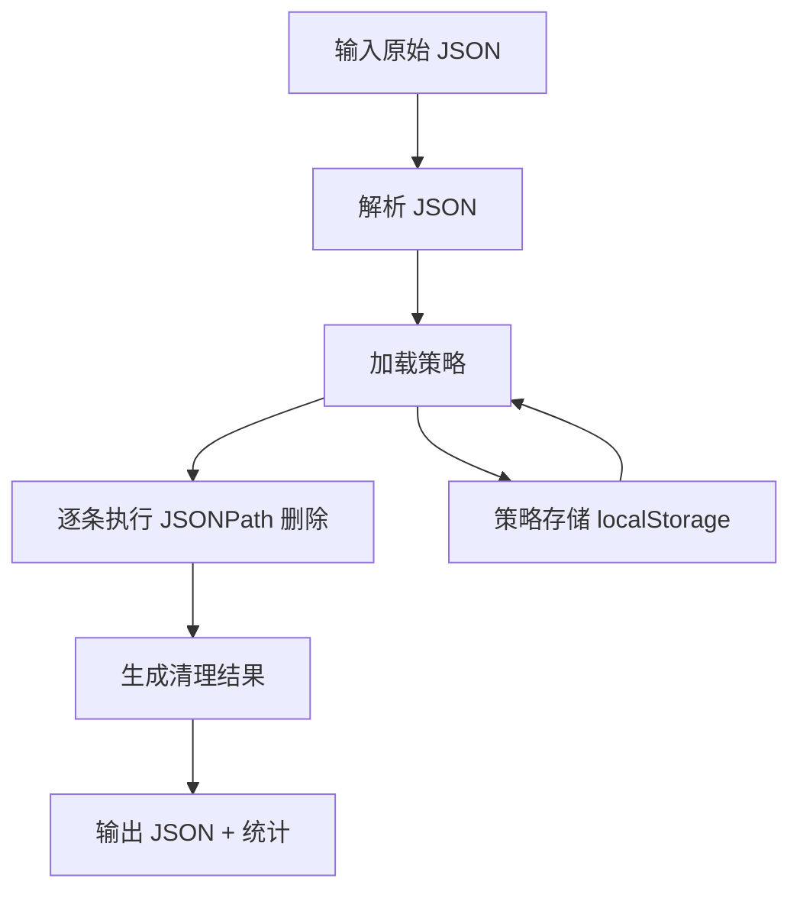

# 变更提案: json-cleaner-strategy

## 元信息
```yaml
类型: 新功能
方案类型: implementation
优先级: P1
状态: 已实施
创建: 2026-02-10
```

---

## 1. 需求

### 背景
当前项目已有 `JSON 格式化` 工具，可完成格式化、压缩、JSONPath 查询与搜索，但还缺少“**按规则剔除字段并形成对外展示版本**”的能力。用户在分享 JSON 给他人分析时，往往需要移除冗余字段（如内部状态、调试字段、敏感扩展字段），并希望这套规则可复用，避免每次手工删改。

### 目标
1. 新增“JSON 清理”能力：根据用户定义规则，从原始 JSON 生成清理后的新 JSON。
2. 支持策略持久化：可保存、选择、更新、删除清理策略。
3. 支持规则复用：一次配置，多次应用，适配不同输入 JSON。
4. 保持工具一致性：沿用现有 `ToolLayout` 交互（输入/输出、复制/下载、错误提示）。

### 约束条件
```yaml
时间约束: 本次 ~plan 仅完成方案设计与任务拆解，不进入代码实施
性能约束: 常规 JSON（建议 <= 2MB）在前端可接受时间内完成解析与清理
兼容性约束: 保持 WXT + React + TypeScript 工程约定，兼容 Chrome/Firefox 扩展页面环境
业务约束: 清理过程全程本地执行，不上传外部服务
```

### 验收标准
- [ ] 支持输入原始 JSON 并执行“按策略清理”，输出新的 JSON。
- [ ] 支持通过规则列表定义要移除的字段路径（基于 JSONPath 表达式）。
- [ ] 支持策略保存、加载、重命名、删除。
- [ ] 支持显示清理结果摘要（如：命中规则数、删除节点数、失败规则提示）。
- [ ] 支持复制与下载清理结果。
- [ ] 非法 JSON 或非法规则时提供可读错误信息且不导致页面崩溃。
- [ ] 新增单元测试覆盖：正常场景 + 边界场景 + 异常场景。

---

## 2. 方案

### 技术方案
1. **新增清理核心模块（utils）**
   - 新建 `utils/json-cleaner.ts`，提供：
     - `applyJsonCleanStrategy(input, strategy)`：执行清理并返回结果摘要。
     - `validateStrategy(strategy)`：策略规则合法性校验。
   - 基于 `jsonpath-plus` 的 `resultType: 'all'` 定位待删除节点，按 `parent + parentProperty` 精确删除。
   - 数组节点删除需按索引从大到小执行，避免删除后索引偏移造成误删。
   - 同一节点被多条规则命中时仅删除一次，并在结果详情中记录“重复命中已跳过”。

2. **新增策略持久化模块（utils）**
   - 新建 `utils/json-clean-strategy-store.ts`，封装策略存储与读取。
   - 初版采用 `localStorage`（扩展页面内持久化，无需新增权限）。
   - 数据结构版本化（预留 `version` 字段），为后续升级兼容做准备。

3. **新增工具页面（components）**
   - 新建 `components/JsonCleaner.tsx`，使用现有 `ToolPageShell / ToolHeader / ToolMain`。
   - 页面能力：
     - 输入区：粘贴原始 JSON
     - 策略区：规则编辑（支持 JSONPath 表达式增删改）+ 策略管理（新建/加载/保存/重命名/删除）
     - 输出区：清理后 JSON + 摘要信息 + 复制/下载
   - 前端布局与交互细节：
     - Header Actions：执行清理（主操作）/复制/下载/清空。
     - Toolbar：策略选择下拉、规则快捷输入区、结果统计入口（可展开规则命中详情）。
     - 主体布局：桌面端双列（左侧输入+策略，右侧输出），窄屏单列堆叠。
     - 状态反馈：覆盖输入空态、策略空态、非法 JSON、非法规则、无命中规则提示。

4. **工具接入**
   - `utils/tool-modules.ts` 增加新工具 `json-cleaner`。
   - `entrypoints/tools.html/App.tsx` 增加路由 `/json-cleaner`。
   - Popup 菜单因复用注册表，在 `popupVisibleToolIds` 未限制时自动显示。

### 影响范围
```yaml
涉及模块:
  - components/JsonCleaner.tsx(新): JSON 清理工具页面与交互
  - utils/json-cleaner.ts(新): 清理规则执行与结果统计
  - utils/json-clean-strategy-store.ts(新): 策略持久化
  - utils/tool-modules.ts: 新增工具注册与 ToolId 类型
  - entrypoints/tools.html/App.tsx: 新增工具路由
  - tests/json-cleaner.test.js(新): 清理核心能力测试
  - tests/tool-modules.test.js: 新增工具注册断言
  - helloagents/modules/*.md: 开发实施后同步模块文档
  - helloagents/CHANGELOG.md: 开发实施后记录变更
预计变更文件: 8-10
```

### 风险评估
| 风险 | 等级 | 应对 |
|------|------|------|
| JSONPath 规则写错导致无匹配或误删 | 中 | 规则逐条校验并返回“命中数/错误原因”，支持预览后再导出 |
| 大 JSON 清理时主线程卡顿 | 中 | 首版限制常规体量并优化删除流程；后续可升级 Worker 化 |
| 策略结构后续演进导致兼容问题 | 中 | 存储结构加入 `version` 字段并提供迁移入口 |
| 根节点规则（`$`）被误用导致结果不可用 | 低 | 明确禁止删除根节点并给出前端提示 |
| 同一策略重复规则导致统计混乱 | 低 | 规则去重与顺序执行日志，结果摘要按规则维度展示 |
| localStorage 容量触顶（约 5MB）导致策略无法保存 | 低 | 捕获 QuotaExceededError 并提示清理历史策略 |

---

## 3. 技术设计（可选）

### 架构设计


### API设计
#### INTERNAL applyJsonCleanStrategy(input, strategy)
- **请求**:
  - `input: string | unknown`
  - `strategy: JsonCleanStrategy`
- **响应**: `JsonCleanResult`
  - `cleaned: unknown`
  - `summary: { totalRules; matchedRules; removedNodes }`
  - `details: Array<{ expression; removed; error?: string }>`

#### INTERNAL saveJsonCleanStrategy(strategy)
- **请求**: `JsonCleanStrategy`
- **响应**: `{ ok: true } | { ok: false; error: string }`

#### INTERNAL listJsonCleanStrategies()
- **请求**: 无
- **响应**: `JsonCleanStrategy[]`

### 数据模型
| 字段 | 类型 | 说明 |
|------|------|------|
| id | `string` | 策略唯一标识 |
| name | `string` | 策略名称（同一存储空间内需唯一） |
| description | `string` | 策略说明（可选） |
| expressions | `string[]` | 需删除字段的 JSONPath 规则列表 |
| updatedAt | `string` | 最近更新时间（ISO 字符串） |
| version | `number` | 策略结构版本 |

---

## 4. 核心场景

> 执行完成后同步到对应模块文档

### 场景: 使用已保存策略清理 JSON
**模块**: JsonCleaner + json-cleaner utils
**条件**: 用户已存在策略，输入原始 JSON
**行为**: 选择策略并点击清理
**结果**: 输出剔除冗余字段后的新 JSON，并显示规则命中统计

### 场景: 新建并保存策略
**模块**: JsonCleaner + strategy-store utils
**条件**: 用户输入规则列表并填写策略名
**行为**: 点击保存策略
**结果**: 策略写入本地存储，可在后续会话复用

### 场景: 规则异常提示
**模块**: JsonCleaner + json-cleaner utils
**条件**: 规则包含非法 JSONPath 表达式
**行为**: 执行清理
**结果**: 不阻断整体流程，异常规则返回错误描述并在结果面板提示

---

## 5. 技术决策

> 本方案涉及的技术决策，归档后成为决策的唯一完整记录

### json-cleaner-strategy#D001: 新增独立工具页而非继续堆叠在 JsonFormatter
**日期**: 2026-02-10
**状态**: ✅采纳
**背景**: `components/JsonFormatter.tsx` 已较大（约 900+ 行），继续叠加“策略管理 + 清理流程”会加剧复杂度与维护成本。
**选项分析**:
| 选项 | 优点 | 缺点 |
|------|------|------|
| A: 在 JsonFormatter 内加“清理模式” | 路径短、复用现有输入输出 | 文件进一步膨胀，状态管理复杂 |
| B: 新增独立 JsonCleaner 工具（选中） | 职责清晰，便于后续扩展与测试 | 需新增路由与模块接入 |
**决策**: 选择方案 B
**理由**: 降低单组件复杂度，保持工具边界清晰。
**影响**: `components/JsonCleaner.tsx`、路由与工具注册。

### json-cleaner-strategy#D002: 删除规则采用 JSONPath 表达式
**日期**: 2026-02-10
**状态**: ✅采纳
**背景**: 用户需要删除“多余字段”，常涉及深层嵌套和数组结构，简单顶层 key 列表不足。
**选项分析**:
| 选项 | 优点 | 缺点 |
|------|------|------|
| A: 仅支持顶层字段名 | 实现简单 | 无法覆盖嵌套对象与数组 |
| B: 采用 JSONPath（选中） | 表达能力强，项目已有依赖 | 规则学习成本略高 |
**决策**: 选择方案 B
**理由**: 覆盖更广的真实场景，且复用既有依赖 `jsonpath-plus`。
**影响**: 清理引擎实现、规则校验与错误提示。

### json-cleaner-strategy#D003: 策略存储首版使用 localStorage
**日期**: 2026-02-10
**状态**: ✅采纳
**背景**: 需在不改动扩展权限的前提下快速实现策略持久化。
**选项分析**:
| 选项 | 优点 | 缺点 |
|------|------|------|
| A: browser.storage.local | 扩展语义更标准 | 需增加封装与异步流改造 |
| B: localStorage（选中） | 实现快、同步调用简单 | 跨上下文共享与容量能力相对有限 |
**决策**: 选择方案 B
**理由**: 先满足“可保存策略”核心需求，后续可平滑迁移为 browser.storage.local。
**影响**: `utils/json-clean-strategy-store.ts` 存储实现与测试策略。
