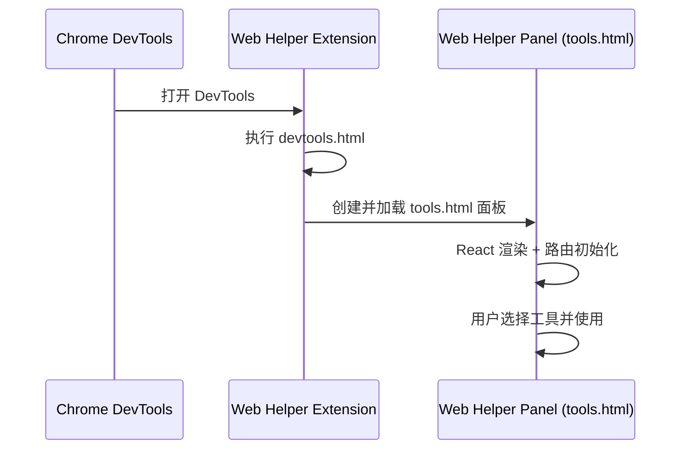

# 架构设计

## 总体架构

```mermaid
flowchart TD
    A[Browser Extension (MV3)] --> B[devtools_page: devtools.html]
    B --> C[utils/devtools-init.ts]
    C --> D[DevTools Panel: tools.html]
    D --> E[React App: entrypoints/tools.html]
    E --> F[Routes + Nav]
    F --> G[components/* Tools]
    A --> H[popup]
    A --> I[background]
    A --> J[content script]
```

## 技术栈
- **前端:** React + TypeScript
- **扩展框架:** WXT（MV3）
- **路由:** `react-router-dom`（HashRouter）
- **样式:** Tailwind CSS

## 核心流程



## 重大架构决策

| adr_id | title | date | status | affected_modules | details |
|--------|-------|------|--------|------------------|---------|

